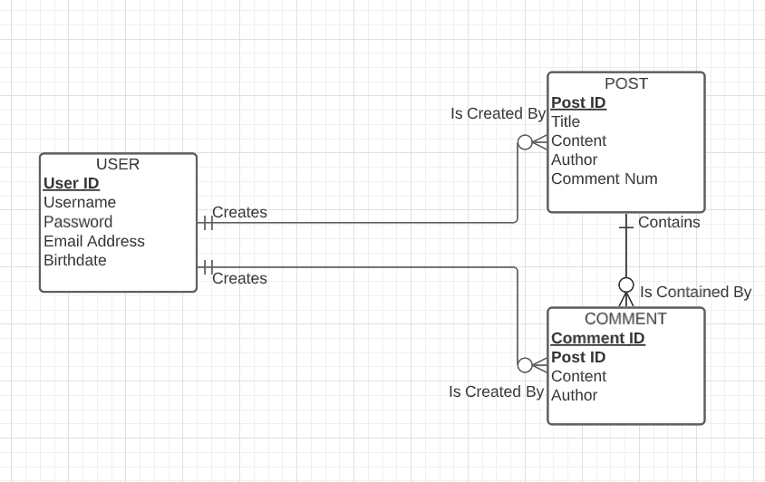
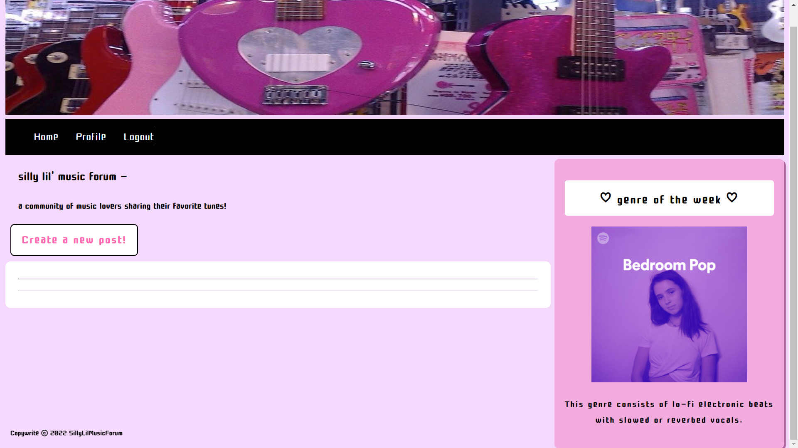
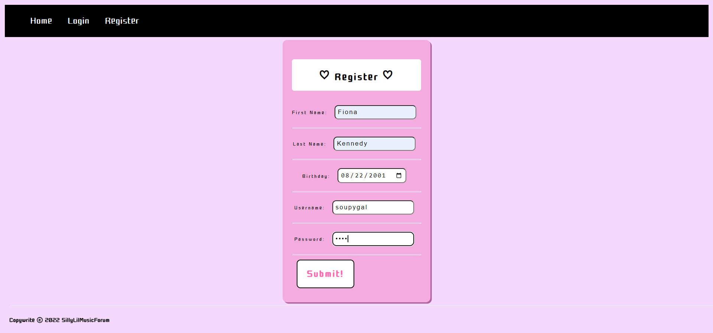
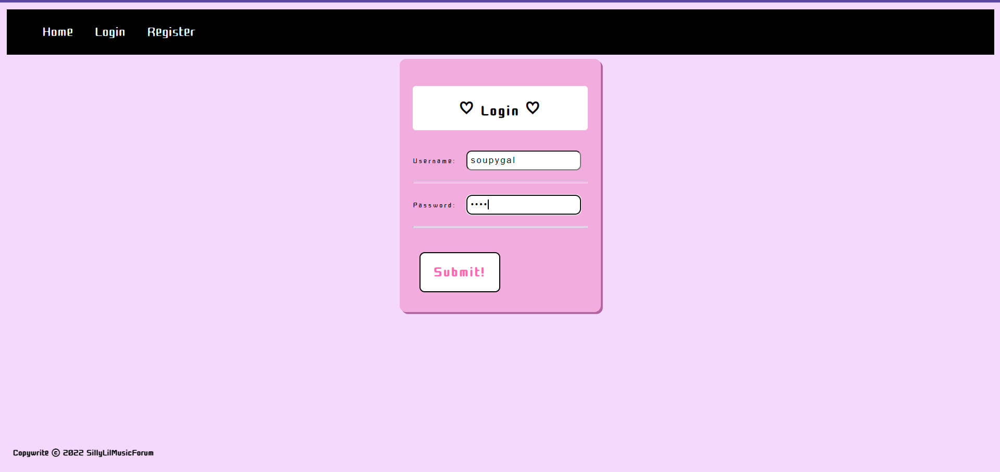
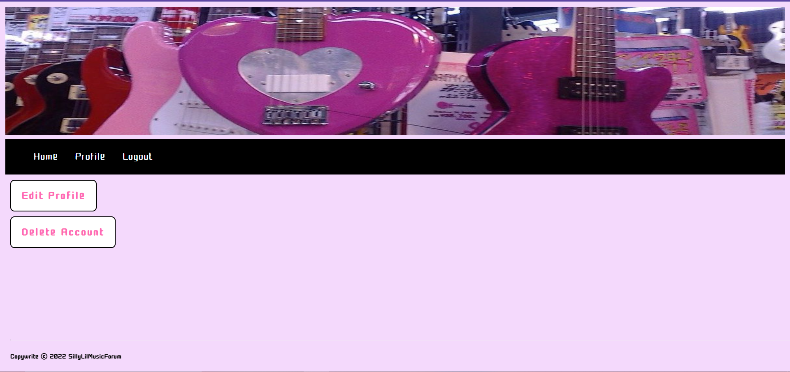
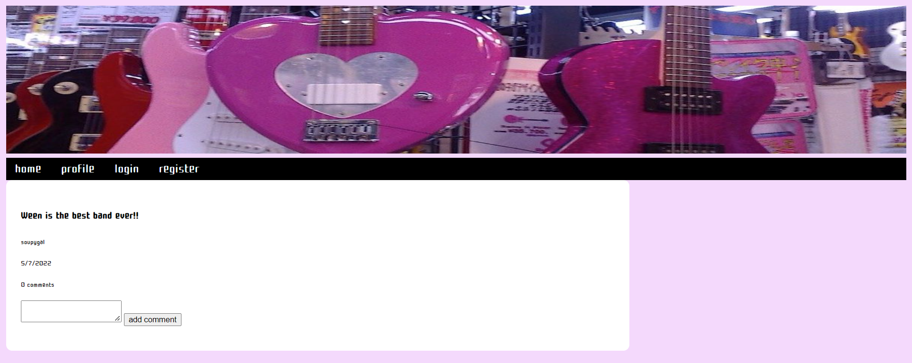

# Website Description
***
The website I created is a forum for discussing/recommending music to other people in the forum community.
Users can register using their info (first name, last name, birthdate, and email address) as well as a unique username and password they choose. Users then have the capabilities of logging into their new account, logging out of their account, and/or deleting their account.
The Home page is where users will be able to create a new post, find posts from other users, and find the "genre of the week" (where a genre will be showcased with a picture and a description).
Sadly, my website is not completed yet. I still need to set up mySQL and I cannot get my edit account button working, as well as my create new post button. In addition to fixing these issues, in the future I want to add genre tabs on the side to allows users to view threads by genre. I also want to add the capability to sort posts by popuarity or date posted.

# Bugs/Issues
***
My create new thread button as well as my edit profile button are not correctly linking to the javascript files, so those buttons do not currently work.
My example threads are not showing up when I input them in javascript, so I will also be fixing this.

# Frameworks/Programming Languages Used
***
**Front-End**
* HTML
* CSS\
**Back-End**
* JavaScript
* Node.js
* mySQL

# Entity-Relationship Diagram (ERD)
***
\

**Entity Descriptions**\

USER: The USER entity stores the info given by the user when they register, as well as an ID.\
(id, username, password, email, birthdate)\

POST: The POST entity stores the info when a new POST is created by a USER, as well as an ID.\
(id, title, content, author, commentnum)\

COMMENT: The COMMENT entity stores the info when a new COMMENT is created by a USER on a POST, as well as an\ ID. It also links to the POST entity and stores the POST ID, so we can tell which POST it is under.\
(id, postid, content, author)\

**Business Rules**

A USER may create any number of POSTs. Each POST must be created by exactly one USER.
A USER may create any number of COMMENTs on a POST. Each COMMENT must be created by exactly one USER.
A COMMENT is contained in exactly one POST. Each POST contains any number of COMMENTs.

# How to Use
***
1. Download project files
2. Download node.js at [Link](https://nodejs.dev/download/)
3. Open your Terminal of choice and enter the following:

    ```
    npm init
    npm install express
    npm install nodemon--save-dev
4. In package.json, add "dev": "nodemon index.js” under "scripts"
5. Enter the following in the Terminal from before:

    ```
    npm run dev (to start server)
    node index.js
    ```
6. In your browser of choice, enter "localhost:3000"
7. Enjoy!

# Screenshots
***
**Home Page**


**Registration**


**Login**


**Profile**


**Thread**
